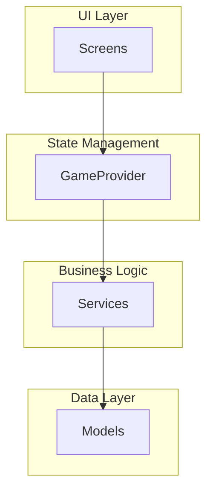
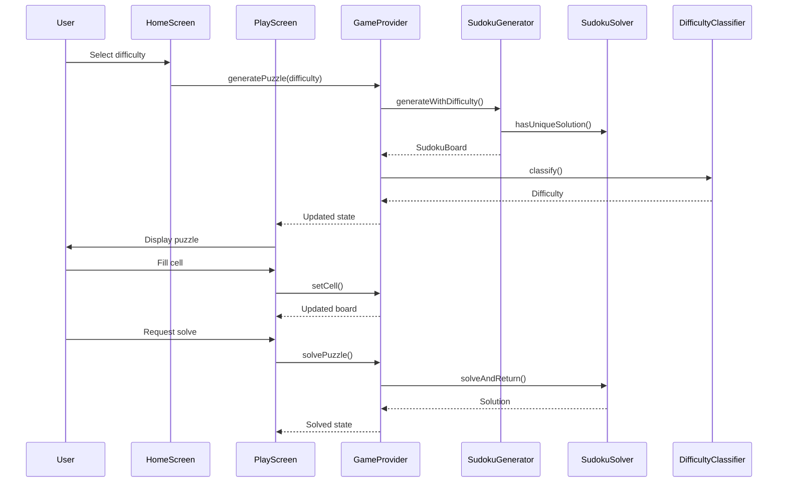
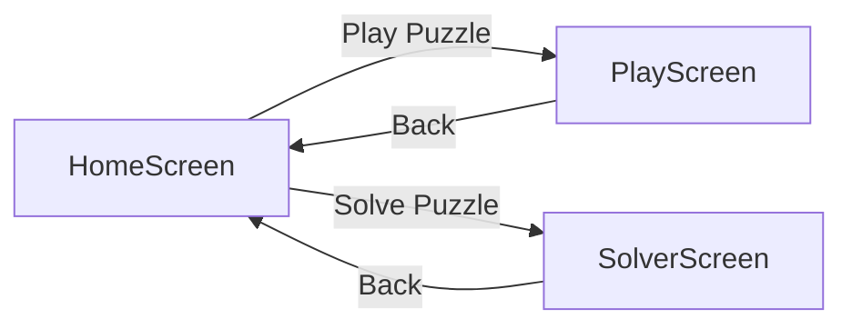
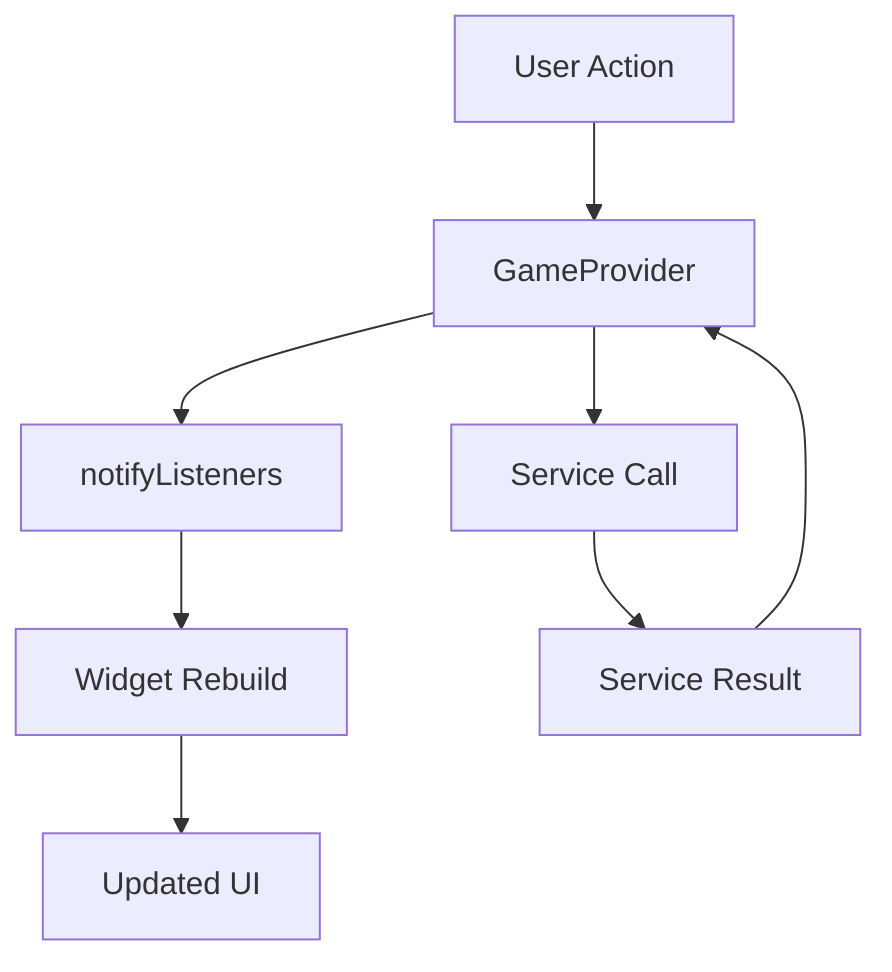
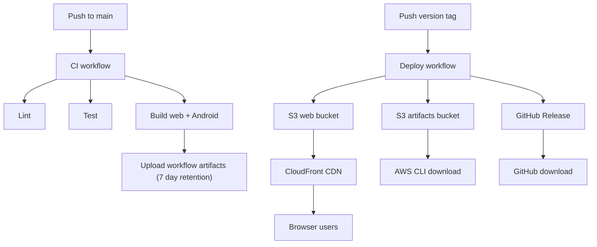
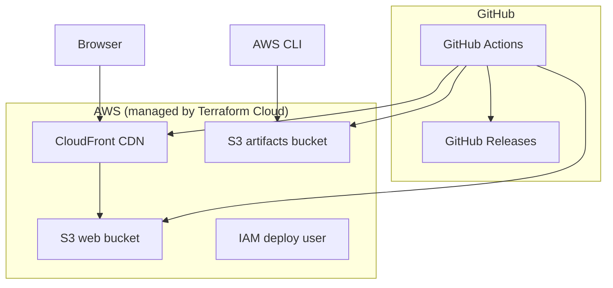

# Architecture documentation

This document describes the architecture and design of the Sudoku Flutter application.

## Application structure

The application follows a layered architecture pattern with clear separation of concerns:

## Component overview

### Models

The `SudokuBoard` model represents the core data structure. It maintains a 9x9 grid of integers where 0 represents an empty cell and 1-9 represent filled cells. The model provides methods for validation, placement checking, and board manipulation.

### Services

The application includes four main services:

**SudokuParser**: Converts text representations of puzzles into `SudokuBoard` instances. Handles both string parsing and asset file loading.

**SudokuSolver**: Implements a recursive backtracking algorithm to solve puzzles. Also provides functionality to verify solution uniqueness by counting solutions.

**SudokuGenerator**: Creates new puzzles by first generating a complete valid board, then removing cells while maintaining uniqueness. Supports symmetric generation and target difficulty levels.

**DifficultyClassifier**: Analyzes puzzles to determine their difficulty level. Uses a combination of clue count and required solving techniques to classify puzzles as easy, medium, hard, or samurai.

### State management

The application uses the Provider pattern for state management. The `GameProvider` extends `ChangeNotifier` and manages the current puzzle state, solution state, selected cell, timer, and difficulty classification. This centralizes state and makes it accessible throughout the application.

### User interface

The UI consists of three main screens:

**HomeScreen**: Entry point that allows users to choose between playing a generated puzzle or solving an existing one.

**PlayScreen**: Interactive game screen where users can fill cells, get hints, solve the puzzle, or reset. Displays a 9x9 grid with visual feedback for selected cells and given clues.

**SolverScreen**: Allows users to input puzzles via text or clipboard, then solves them and displays the solution alongside the original puzzle, along with uniqueness verification and difficulty classification.

## Data flow

## Screen navigation

Navigation is handled using Flutter's `Navigator` with simple push and pop operations. Each screen is independent and can be navigated to from the home screen.

## State management flow

When a user interacts with the UI, the action is handled by the `GameProvider`. The provider updates its internal state and calls `notifyListeners()`, which triggers a rebuild of all widgets that are listening to the provider. This ensures the UI always reflects the current state.

## CI/CD and release pipeline

The project uses a two-stage pipeline. The CI workflow runs on every push to `main` when app code or the Makefile changes. It runs lint, tests, and builds, then uploads artifacts. To deploy, you create and push a version tag, which triggers the deploy workflow separately.

## Artifact distribution

Build artifacts are available from three locations, each suited to different use cases.

**GitHub Actions workflow artifacts** are generated on every CI run (not just tagged releases). They are retained for 7 days and can be downloaded from the Actions tab. This is useful for testing builds from feature branches or pull requests before they are merged.

**GitHub Releases** are created for each version tag. The APK is attached to the release as a downloadable asset. This is the best option for sharing a specific version with others since releases are permanent and have a stable URL.

**S3 artifacts bucket** stores every deployed APK organized by version (`android/<version>/march_sudoku.apk`). The bucket has versioning enabled, so redeployments of the same version preserve previous uploads. This is the best option for automated retrieval or when AWS credentials are already available.

## Infrastructure components

The infrastructure is provisioned using Terraform Cloud. The organization and workspace are configured in `infrastructure/main.tf`. Remote state, locking, and run history are handled by Terraform Cloud. The configuration lives in the `infrastructure/` directory, split across focused files:

**main.tf** configures the Terraform Cloud backend, AWS provider, and shared locals.

**s3.tf** defines the web hosting bucket (with static website configuration, versioning, and a bucket policy granting CloudFront read access) and the artifacts bucket (with versioning and blocked public access).

**cloudfront.tf** creates the CloudFront distribution with the web bucket as its origin, using an Origin Access Identity so the bucket is not directly accessible.

**iam.tf** provisions a dedicated IAM user for GitHub Actions with least-privilege permissions scoped to the two S3 buckets and CloudFront invalidation only.

**variables.tf** declares input variables for project name, region, and environment.

**outputs.tf** exposes the CloudFront URL, bucket names, distribution ID, and deploy credentials.
